<h2 align="center"> 
Thiết lập môi trường lập trình C/C++
</h2>

## [1 - Các bước viết chương trình](#programmingsteps)
## [2 - Môi trường phát triển tích hợp](#ides)
### [2.1 - Dev-C++](#devcpp)
### [2.2 - Visual Studio Code](#vscode)
### [2.3 - CLion](#clion)
## [3 - Tham khảo](#references)

<br>

## 1 - Các bước viết chương trình <a name="programmingsteps"/>
## 2 - Môi trường phát triển tích hợp<a name="ides"/>
### 2.1 - Dev-C++ <a name="devcpp"/>
#### Đặc điểm
- [Dev-C++](https://www.bloodshed.net/) được ưa chuộng hàng đầu trong dạy/học lập trình C/C++ bởi: mã nguồn mở (open-source), rất gọn nhẹ và đủ tính năng cơ bản;
- Hỗ trợ một số trình biên dịch khác nhau (như [MingW](https://www.mingw-w64.org/), [Cygwin](http://cygwin.com/));
- Chỉ chạy trên Windows.
#### Cài đặt
##### [Tải nguồn cài đặt Dev-C++](https://sourceforge.net/projects/orwelldevcpp/files/latest/download)
##### Cài đặt Dev-C++
- Chạy file `Dev-Cpp 5.11 TDM-GCC 4.9.2 Setup.exe` vừa tải xuống để bắt đầu cài đặt.

- **License Agreement**: chọn `Agree`.
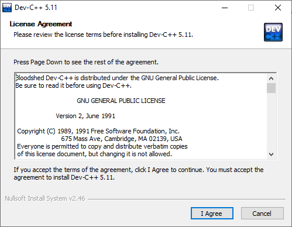

- **Choose Components**: nên chọn mặc định (Full) để cài đầy đủ các thành phần. Nếu đã từng cài Dev-C++ trước đó, nên chọn thêm "Remove old configuration files" để gỡ bỏ các thiết lập cũ.<br>
Chọn **Next**.
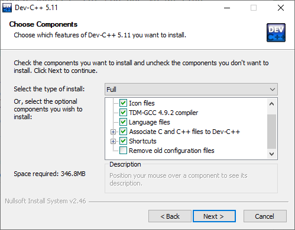

- **Choose Install Location**: chọn vị trí cài đặt trên ổ đĩa. 
Nhấn **Install**.
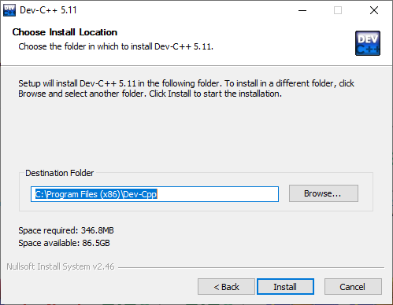

- Nhấn **Finish** để hoàn tất cài đặt.
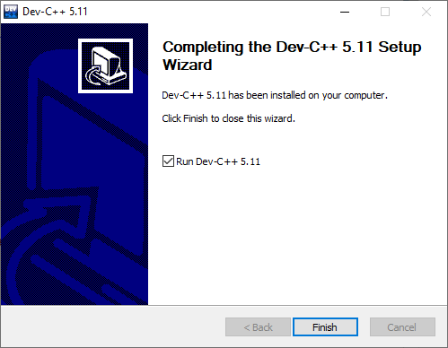

#### Sử dụng Dev-C++
Viết chương trình in ra màn hình dòng chữ "Hello World!".
- Khởi động Dev-C++
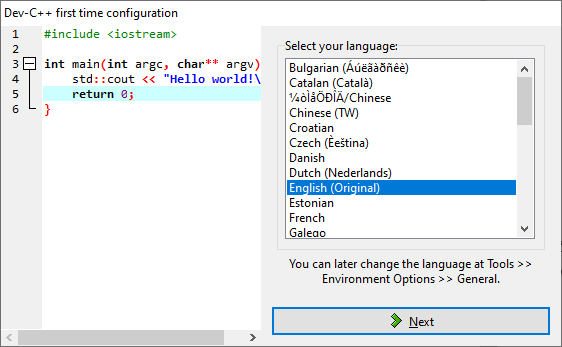

Khi chạy lần đầu, Dev-C++ yêu cầu chọn lựa về ngôn ngữ, theme (các thiết lập về font chữ, màu sắc và các biểu tượng). Hãy chọn thiết lập mặc định và nhấn **OK** để hoàn tất.
- Tạo file mã nguồn 
Chọn **File->New->Source File**, hoặc nhấn tổ hợp phím **Ctrl+N**, hoặc chọn biểu tượng **New** ở thanh công cụ chính.

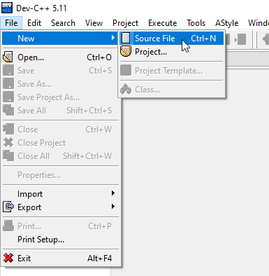

- Viết chương trình (Edit)

Ở màn hình soạn thảo, viết mã lệnh chương trình.
```c
// The first C program: print "Hello World" message

#include <stdio.h>

int main()
{
	printf("Hello World!");
}
```
Chọn **File->Save**, hoặc nhấn **Ctrl+S** để lưu lại file mã nguồn. Nên đặt tên file có ý nghĩa, chẳng hạn `helloworld.c`
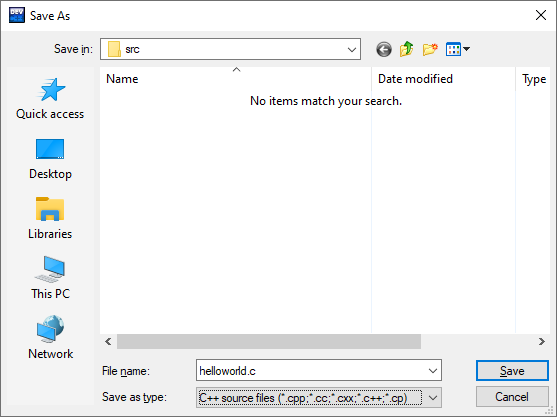

- Biên dịch (Compile)

Chọn **Excecute->Compile**, hoặc nhấn **F9**, hoặc nhấn biểu tượng **Compile** trên thanh công cụ.
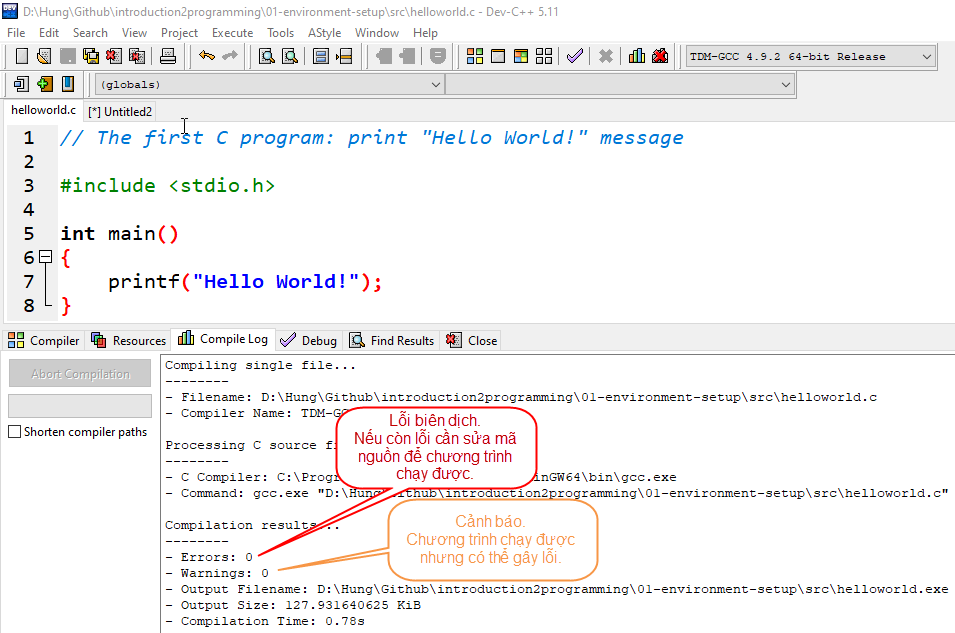

Cửa sổ **Compiler Log** hiện kết quả biên dịch.

Nếu chương trình không có lỗi nào (số lỗi = 0), trình biên dịch (compiler) sẽ dịch file mã nguồn `helloworld.c` và liên kết với các thư viện có dùng đến trong chương trình để tạo thành file thực thi được trên máy tính, ở đây là file `helloworld.exe`.

**Lỗi (errors)** 

Là các lỗi xảy ra khi biên dịch. Cần phải quay lại trình soạn thảo để sửa hết các lỗi này.

*Một số lỗi thường gặp ở người mới học lập trình:*

Thiếu ký tự `;` phân tách các câu lệnh:
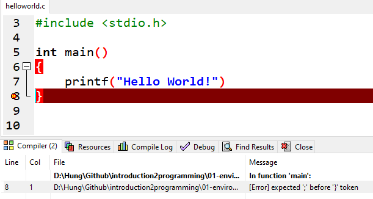

Nhập chưa đúng tên hàm, từ khóa chuỗi định dạng, cú pháp lệnh:
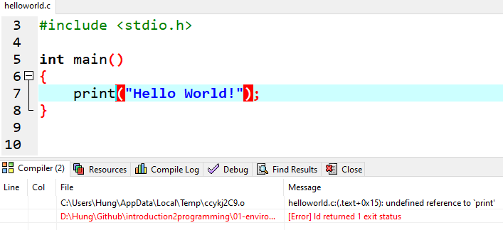

**Cảnh báo (warnings):**

Là các thông báo của trình biên dịch, cảnh báo chương trình vẫn chạy được nhưng có thể gây ra lỗi. 

*Ví dụ về cảnh báo:*
Trong trường hợp này, cảnh báo ở dòng 5 do mã nguồn thiếu khai báo thư viện vào ra chuẩn `stdio.h`. 


- Chạy chương trình (Run)
Chọn **Excecute->Run**, hoặc nhấn **F10**, hoặc nhấn biểu tượng **Run** trên thanh công cụ.
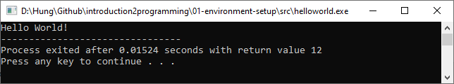


### CLion
#### Đặc điểm
#### Cài đặt
#### Sử dụng

### Visual Studio Code
#### Đặc điểm
#### Cài đặt
#### Sử dụng

### Eclipse
#### Đặc điểm
#### Cài đặt
#### Sử dụng

### Code::Blocks
#### Đặc điểm
#### Cài đặt
#### Sử dụng

### XCode
#### Đặc điểm
#### Cài đặt
#### Sử dụng


### [Tham khảo](References.md)
