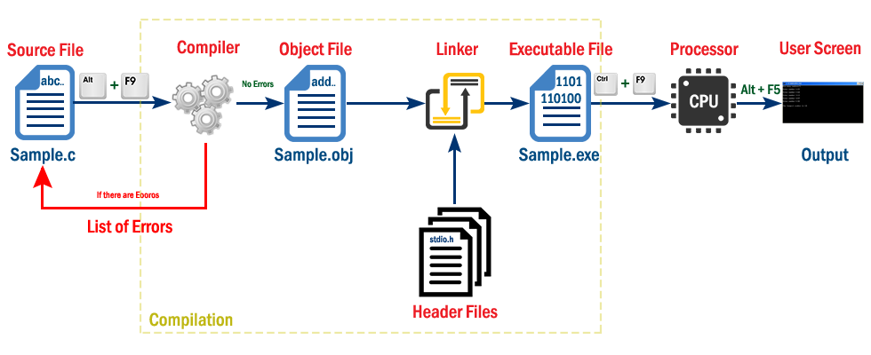

<h2 align="center"> 
Thiết lập môi trường lập trình C/C++
</h2>

- ## [Các bước viết chương trình](#programmingsteps)
- ## [Môi trường phát triển tích hợp](#ides)
    ### [Dev-C++](devcpp)
    ### [Visual Studio Code](vscode)
 

## Các bước viết chương trình <a name="programmingsteps"/>
<a href="http://www.btechsmartclass.com/c_programming/C-Creating-and-Running-C-Program.html">
         

## Môi trường phát triển tích hợp<a name="ides"/>
### - [Dev-C++](devcpp)
- Mã nguồn mở (open-source).
- Rất gọn nhẹ & đủ tính năng cơ bản. 
- Chỉ chạy trên Windows.

### - [Visual Studio Code](vscode)
- Gọn nhẹ với nhiều tính năng cao cấp, do Microsoft phát triển.
- Chạy trên Windows, macOS và Linux.
- Hỗ trợ nhiều ngôn ngữ (C/C++, C#, Java, Python, ...).
- Miễn phí.

### - [CLion](https://www.jetbrains.com/clion/)
- Hỗ trợ tạo ứng dụng chuyên nghiệp C/C++ đa nền tảng (cross-platform).
- Chạy trên Windows, macOS and Linux.
- Nhiều tính năng cao cấp: Phân tích mã nguồn (code analysis), tái cấu trúc mã nguồn (code refactoring), tự động sinh mã nguồn (code generation).

### - [Visual Studio](https://visualstudio.microsoft.com/)
- Là công cụ phát triển chuyên nghiệp, phát hành bởi Microsoft.
- Có thể tạo ứng dụng cho Windows, macOS, Linux.
- Đầy đủ tính năng cao cấp.
- Đòi hỏi máy tính cấu hình đủ mạnh & bộ nhớ lớn.

### - [Code::Blocks](https://www.codeblocks.org/)
### - [Eclipse](https://www.eclipse.org/)
### - [XCode](https://developer.apple.com/xcode/)

### [Tham khảo](References.md)
