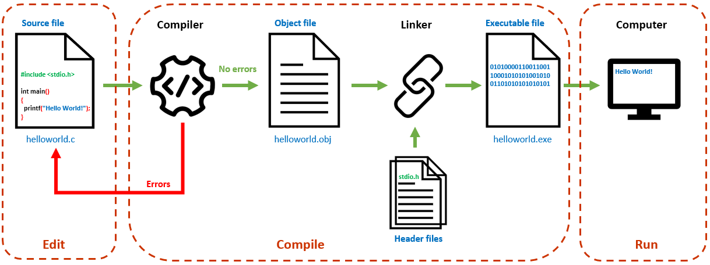

<h2 align="center"> 
Thiết lập môi trường lập trình C/C++
</h2>

### Mục tiêu:
- Xác định được quy trình tạo một chương trình máy tính
- Thiết lập được môi trường lập trình C/C++ thông dụng
- Tạo được chương trình đơn giản đầu tiên

## [1 - Các bước viết chương trình](#programmingsteps)
## [2 - Một số công cụ lập trình C/C++ thông dụng](#ides)
### [2.1 - Dev-C++](devcpp)
### [2.2 - Visual Studio Code](vscode)
<br>

## 1- Các bước viết chương trình <a name="programmingsteps"/>

Khi cần giải quyết một bài toán bằng máy tính, đầu tiên cần xây dựng được *giải thuật*, sau đó sử dụng một (hoặc một số) ngôn ngữ lập trình để *cài đặt* giải thuật thành *chương trình máy tính*.

Có thể chia quy trình viết chương trình thành ba bước: viết mã nguồn (edit), dịch (compile) và chạy (run).

### Bước 1: Viết mã nguồn
- Mã nguồn (source code) là những dòng lệnh được viết theo cú pháp của một ngôn ngữ lập trình cụ thể, chẳng hạn như C/C++, Java, Python,... 
- Ở các ngôn ngữ lập trình bậc cao, các dòng lệnh được viết theo cú pháp gần gũi với ngôn ngữ tự nhiên, thường là tiếng Anh. <br> *Ví dụ*: Để in một thông báo lên màn hình, câu lệnh trong ngôn ngữ C như sau:
```c 
printf("This is a message");
```



### Bước 2: Dịch
- Bước dịch (compiling) chuyển đổi mã nguồn (là các dòng lệnh con người hiểu được) sang mã máy (máy tính hiểu & thực thi được).
- Quá trình dịch được thực hiện bởi chương trình dịch (compiler).
- Nếu mã nguồn còn có lỗi cú pháp, chương trình dịch sẽ thông báo lỗi. Người lập trình cần quay lại **Bước 1** để khắc phục hết các lỗi này.
- Nếu không còn lỗi cú pháp, trình biên dịch chuyển đổi file mã nguồn thành file mã máy có phần mở rộng là `.obj`; sau đó liên kết với các thư viện liên quan để tạo thành file thi hành được trên máy tính (có phần mở rộng là `.exe`).

### Bước 3: Chạy
- Sau khi biên dịch thành công, file thực thi (executable file) có thể chạy trên máy tính.
- Chương trình chạy được không đồng nghĩa với chương trình chạy đúng.
- Chương trình cần chạy thử nhiều lần với các tình huống khác nhau của dữ liệu vào để phát hiện và khắc phục các lỗi logic (nếu có). Nếu còn lỗi khi chạy, quay lại **Bước 1** để khắc phục.
- Các công cụ lập trình thường hỗ trợ chức năng gỡ rối (Debug), giúp dò tìm lỗi khi chạy chương trình.

**Chú ý:**
- Đa số công cụ lập trình C/C++ hiện nay đều tích hợp các chức năng soạn thảo mã nguồn, biên dịch, chạy và gỡ rối; vì thế các công cụ này gọi là môi trường phát triển tích hợp (Integrated Development Environment - IDE).

## 2 -  Một số công cụ lập trình C/C++ thông dụng <a name="ides"/>
### 2.1 - [Dev-C++](devcpp)
- Rất gọn nhẹ & đủ tính năng cơ bản. 
- Mã nguồn mở (open-source).
- Chỉ chạy trên Windows.

### 2.2 - [Visual Studio Code](vscode)
- Gọn nhẹ với nhiều tính năng cao cấp, do Microsoft phát triển.
- Chạy trên Windows, macOS và Linux.
- Miễn phí.

### 2.3 - Một số IDE khác
- [CLion](https://www.jetbrains.com/clion/)
- [Visual Studio](https://visualstudio.microsoft.com/)
- [Eclipse](https://www.eclipse.org/)
- [XCode](https://developer.apple.com/xcode/)

## [Tài liệu tham khảo](References.md)
