## Lập trình C/C++ với Dev-C++
- ### [Đặc điểm](#specs)
- ### [Cài đặt](#install)
- ### [Sử dụng](#use)

### Đặc điểm <a name="specs"/>
- [Dev-C++](https://www.bloodshed.net/) được ưa chuộng hàng đầu trong dạy/học lập trình C/C++ bởi: rất gọn nhẹ, đủ tính năng cơ bản, mã nguồn mở (open-source).
- Dev-C++ hỗ trợ một số trình biên dịch khác nhau ([MingW](https://www.mingw-w64.org/), [Cygwin](http://cygwin.com/)).
- Dev-C++ chỉ chạy trên Windows.

### Cài đặt Dev-C++ <a name="install"/>
#### [Tải nguồn cài đặt Dev-C++](https://sourceforge.net/projects/orwelldevcpp/files/latest/download)
#### Cài đặt Dev-C++
- Chạy file `Dev-Cpp 5.11 TDM-GCC 4.9.2 Setup.exe` vừa tải xuống để bắt đầu cài đặt.

- **License Agreement**: chọn **I Agree**.
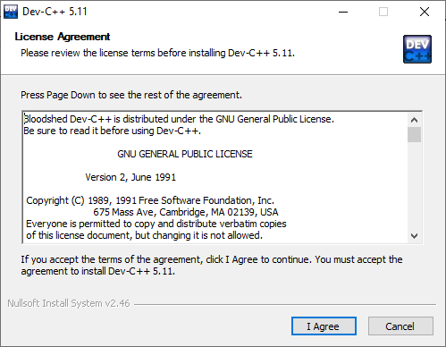

- **Choose Components**: nên chọn mặc định (Full) để cài đầy đủ các thành phần. Nếu đã từng cài Dev-C++ trước đó, nên chọn thêm ``Remove old configuration files`` để gỡ bỏ các thiết lập cũ.

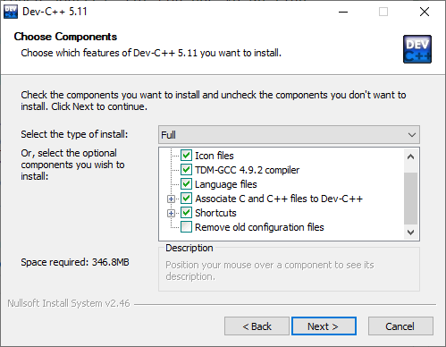

Chọn **Next**.

- **Choose Install Location**: chọn vị trí cài đặt trên ổ đĩa. 
Nhấn **Install**.
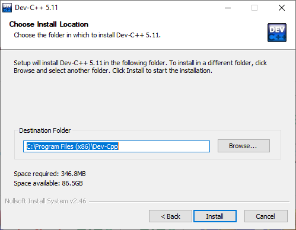

- Nhấn **Finish** để hoàn tất cài đặt.
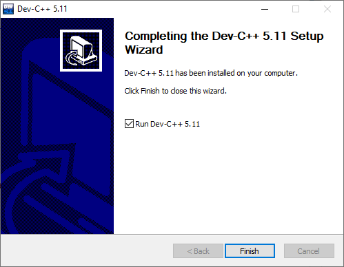

### Sử dụng Dev-C++ <a name="use"/>
Viết chương trình in ra màn hình dòng chữ "Hello World!".
- Khởi động Dev-C++
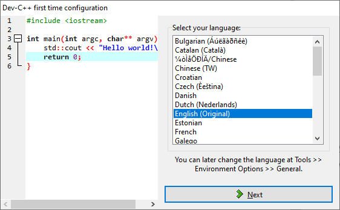

Khi chạy lần đầu, Dev-C++ yêu cầu chọn lựa về ngôn ngữ, theme (các thiết lập về font chữ, màu sắc và các biểu tượng). Chọn thiết lập mặc định và nhấn **OK** để hoàn tất.

#### [Bước 1: Viết chương trình (Edit)](#edit)
- Tạo file mã nguồn

Chọn **File->New->Source File**, hoặc nhấn tổ hợp phím **Ctrl+N**, hoặc chọn biểu tượng **New** ở thanh công cụ chính.

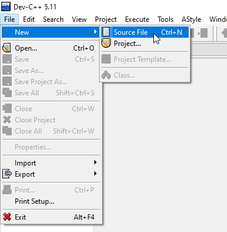

Ở màn hình soạn thảo, tiến hành viết mã lệnh chương trình.
```c
// The first C program: print "Hello World" message

#include <stdio.h>

int main()
{
	printf("Hello World!");
}
```
- Lưu file mã nguồn

Chọn **File->Save**, hoặc nhấn **Ctrl+S** để lưu lại file mã nguồn. Nên đặt tên file có ý nghĩa, chẳng hạn `helloworld.c`
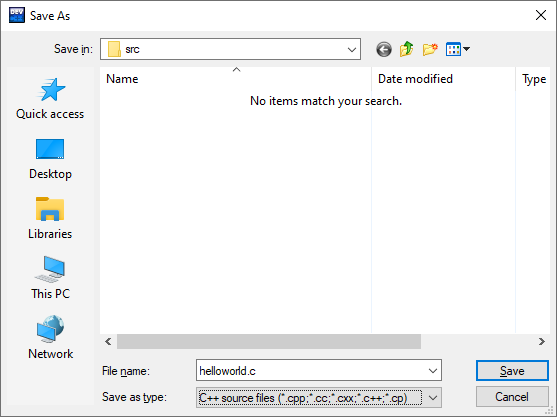

#### Bước 2: Biên dịch (Compile)

Chọn **Excecute->Compile**, hoặc nhấn **F9**, hoặc nhấn biểu tượng **Compile** trên thanh công cụ.

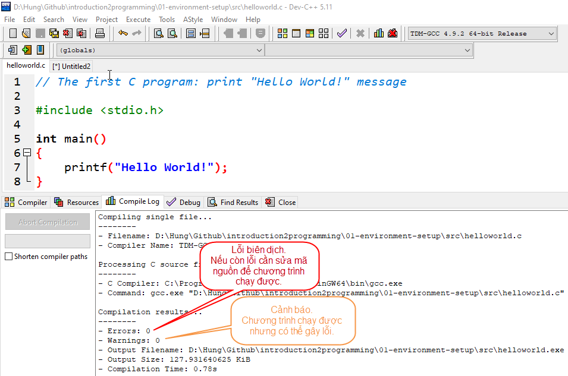

Cửa sổ **Compiler Log** hiện kết quả biên dịch.

Nếu chương trình không có lỗi nào (errors = 0), trình biên dịch (compiler) sẽ dịch file mã nguồn `helloworld.c` và liên kết với các thư viện có dùng đến trong chương trình để tạo thành file thực thi được trên máy tính, ở đây là file `helloworld.exe`.

**Lỗi (errors)** 

Là các thông báo của trình biên dịch khi chương trình còn lỗi (loại "lỗi tầm thường"). Cần phải quay lại **Bước 1** để sửa hết các lỗi này.

*Một số lỗi thường gặp ở người mới học lập trình:*

Thiếu ký tự `;` phân tách các câu lệnh:

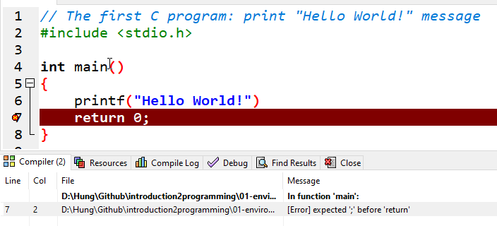

Nhập chưa đúng tên hàm, từ khóa chuỗi định dạng, cú pháp lệnh, v.v..:

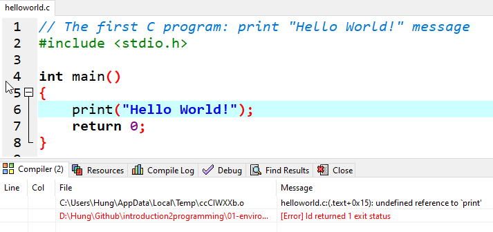

**Cảnh báo (warnings):**

Là các thông báo của trình biên dịch, cảnh báo chương trình vẫn chạy được nhưng có thể gây ra lỗi. 

*Ví dụ:*

Trong trường hợp này, cảnh báo ở dòng 5 do mã nguồn thiếu khai báo thư viện vào ra chuẩn `stdio.h`. 

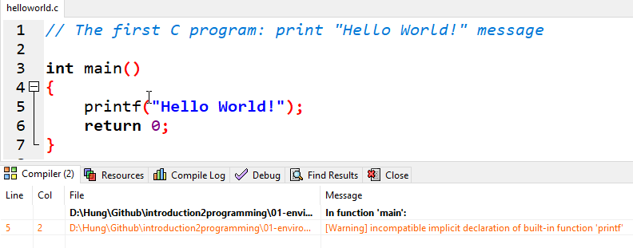


#### Bước 3: Chạy chương trình (Run)

Chọn **Execute->Run**, hoặc nhấn **F10**, hoặc nhấn biểu tượng **Run** trên thanh công cụ.
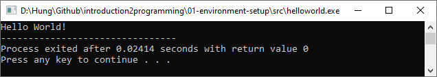
