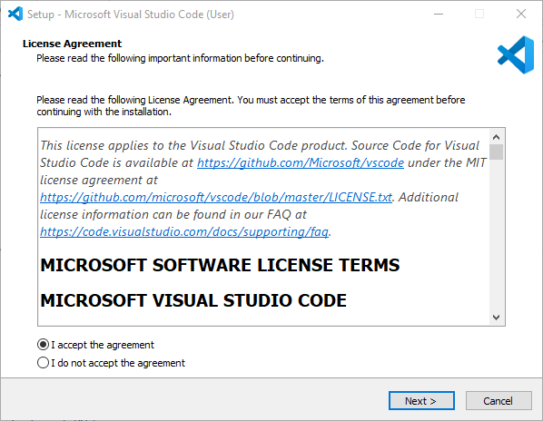
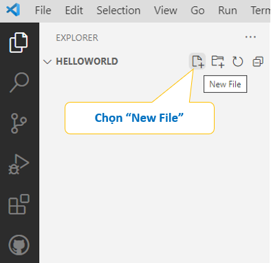
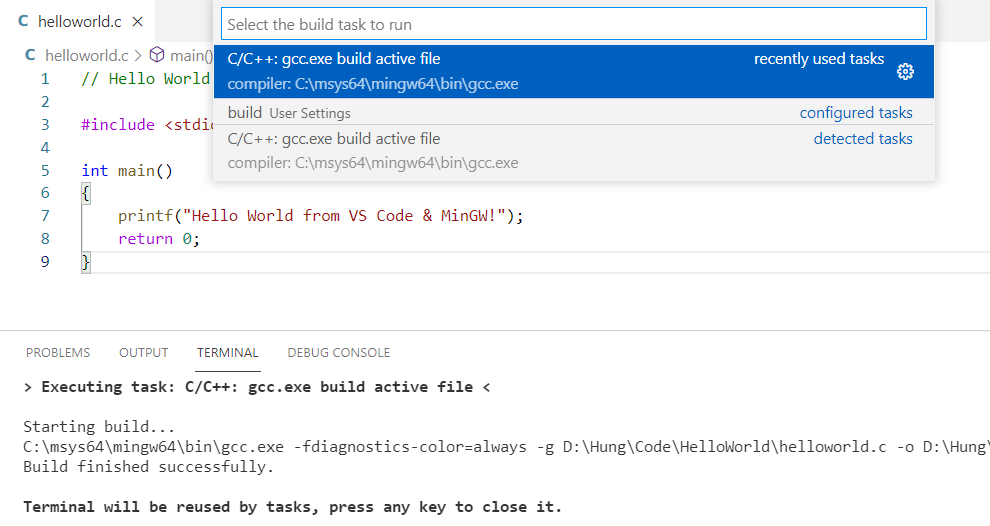
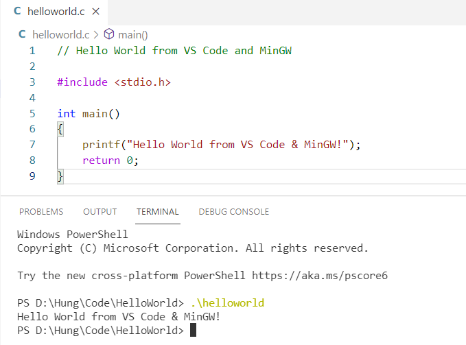

## [Lập trình C/C++ với Visual Studio Code](https://code.visualstudio.com/docs/languages/cpp)

## [Đặc điểm](#specs)
## [Cài đặt](#install)
## [Sử dụng](#use)
<br>

## Đặc điểm <a name="specs"/>
- Visual Studio Code là công cụ viết mã nguồn (code editor), không phải là IDE đầy đủ. Để viết chương trình C/C++ với VS Code, cần cài đặt thêm các công cụ sau:
    * Gói mở rộng (extension) hỗ trợ viết mã nguồn C/C++ và debug.
    * Trình biên dịch (compiler) C/C++.
- Cung cấp khả năng mở rộng để lập trình với nhiều ngôn ngữ, như C/C++, C#, Java, Python, PHP.
- Miễn phí & mã nguồn mở. 
- Tích hợp Git - công cụ quản lý mã nguồn phân tán.
- Chạy trên Windows, macOS và Linux.

## Cài đặt VS Code, C/C++ extention, và C/C++ compiler trên Windows <a name="install">

### Cài đặt VS Code
- [Tải về gói cài đặt](https://code.visualstudio.com/Download). Chọn phiên bản cho Windows.
- Mở file đã tải xuống để bắt đầu cài đặt.

- **License Agreement**: Chọn "I accept the agreement" và nhấn **Next**.


- **Select Additional Tasks**: Để các tùy chọn mặc định và nhấn **Next**.


- **Ready to Install**: Nhấn **Install** và chờ quá trình cài đặt hoàn tất.


### Cài C/C++ extention
- Khởi động VS Code


Chọn biểu tượng "Extensions" (Ctrl+Shift+X), nhập C/C++ vào ô tìm kiếm, chọn cài đặt gói **C/C++ IntelliSense, debugging, and code browsing** của Microsoft.

### Cài đặt trình biên dịch
Trình biên dịch MinGW (Minimalist GNU for Windows), miễn phí, thường được sử dụng. 
- [Tải về MinGW](https://github.com/msys2/msys2-installer/releases/download/2021-07-25/msys2-x86_64-20210725.exe).

- Mở file đã tải xuống để bắt đầu cài đặt.


Nhấn **Next**.

- **Installation Folder**. Chọn vị trí cài đặt trên ổ đĩa.


Nhấn **Next** để cài đặt. Nhấn **Finish** để hoàn tất.

- Thiết lập biến môi trường


Tại ô tìm kiếm của Windows, gõ "Edit environment variables for account" rồi chọn mở thiết lập tương ứng.


- **User variables for ...**: Chọn "PATH" và nhấn **Edit**.

- **Edit evironment variable**: Chọn **New**.


Bổ sung dòng khai báo đường dẫn đến thư mục cài đặt MinGW, ở đây là `C:\msys64\mingw64\bin`. Nhấn **OK** để hoàn tất.

- Kiểm tra cài đặt trình biên dịch:

Mở cửa sổ Command Promt và gõ lệnh:
```console
g++ --version
gdb --version
```


## Lập trình C/C++ với VS Code <a name="use">
Tạo chương trình "Hello World" với VS Code.

- Khởi động VS Code.
- Mở cửa sổ Terminal bằng cách chọn **Terminal->New Terminal** (Ctrl+Shift+`).

Nhập các lệnh sau:
```console
mkdir HelloWorld
cd HelloWorld
code .
```
- **Bước 1**: Viết mã nguồn

Ở cửa số Explorer, chọn **New File** và nhập tên file là `helloworld.c`.


Viết mã nguồn ở file `helloworld.c`.
```c
// Hello World from VS Code and MinGW

#include <stdio.h>

int main()
{
    printf("Hello World from VS Code & MinGW!");
    return 0;
}
```

- **Bước 2**: Biên dịch

Chọn **Terminal->Run Build Task** (Ctrl+Shift+B) để biên dịch.


Nếu không còn lỗi cú pháp, ở cửa sổ Terminal trình biên dịch báo "Build finished successfully". Nhấn phím bất kỳ để đóng lại.

- **Bước 3**: Chạy chương trình

Mở Terminal và nhập tên file `helloworld` để chạy chương trình:



