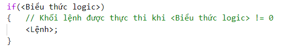

<h2 align="center"> 
Các cấu trúc điều khiển
</h2>


<div class="header">
<h3>Cấu trúc tuần tự (sequence)</h3>
<h3>Cấu trúc rẽ nhánh (selection)</h3>
<ul>
    <li><h4>Câu lệnh <b>if</b></h4></li>
    <li><h4>Câu lệnh <b>switch</b></h4></li>
</ul>

<h3>Cấu trúc lặp (repetition)</h3>
<ul>
    <li><h4>Lệnh <b>for</b></h4></li>
    <li><h4>Lệnh <b>while</b></h4></li>
    <li><h4>Lệnh <b>do ... while</b></h4></li>
</ul>
</div>

## Cấu trúc tuần tự (sequence)

- Đặt các câu lệnh theo thứ tự cần thực hiện.


## Cấu trúc rẽ nhánh (selection)

### Câu lệnh **if**

#### Dạng 1




Ví dụ:
```c
int a = 36;
if(a % 2 == 0) printf("%d la so chan\n", a);
```

#### Dạng 2


Ví dụ:
```c
int a = 36;
if(a % 2 == 0) printf("%d la so chan\n", a);
else printf("%d la so le\n", a);
```

<div class="note">
<p>
<ul>
    <li>Nếu khối chỉ có 1 câu lệnh thì không cần đặt trong cặp ký tự <code>{}</code>.</li>
    <li>Câu lệnh <code>if</code> có thể lồng vào nhau, khi đó điều kiện sau từ khóa <code>else</code> sẽ ngược lại với điều kiện ở <code>if</code> ngay trước nó.</li>
    <li>Khi sử dụng các lệnh <code>if</code> lồng nhau, nên sử dụng cấu trúc <code>else</code> để loại trừ các trường hợp.</li>
</ul>
</p>
</div>

<details>
<summary>Ví dụ</summary>
<p>

```c
/*
Tính tiền taxi dựa vào quãng đường đi và bảng giá.
Bảng giá:
<= 1 km đầu: 15000 đ
Từ km thứ 2 đến km thứ 5: 13500 đ/km
Từ km thứ 6 trở đi: 11000 đ/km
Nếu vượt 120 km được giảm 10% tổng tiền.

* Input: Số km (nhập từ bàn phím)
* Output: Số tiền phải thanh toán.
*/

#include <stdio.h>

int main()
{
	float sokm, sotien=0;
	
	printf("Nhap quang duong di (km):");
	scanf("%f", &sokm);
	
	if(sokm <= 0)	printf("Quang duong phai > 0.\n");
	else
		if(sokm <= 1)	sotien = 15000;
		else
			// <-> (sokm > 1 && sokm <= 5)
			if(sokm <= 5)	sotien = 15000 + (sokm - 1) * 13500;
			else
				// <-> (sokm > 5 && sokm <= 120)
				if(sokm <= 120) 
					sotien = 15000 + 4 * 13500 + (sokm - 5) * 11000;
				else
					// <-> (sokm > 120)
					sotien = (15000 + 4 * 13500 + (sokm - 5) * 11000) * 0.9;
				
	printf("\n--------------------------------\n");
	printf("Quang duong:\t%10.2f (km)\nSo tien:\t%10.2f (d)\n", sokm, sotien);
}
```

</p>
</details>