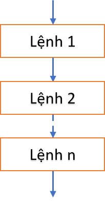
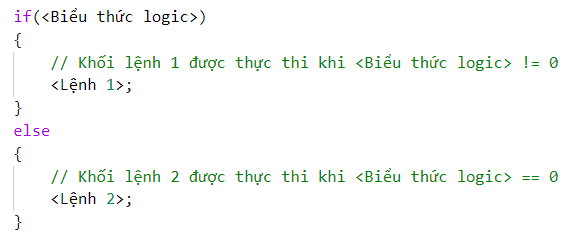
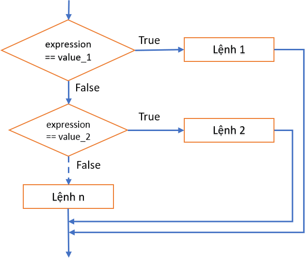

<h2 align="center"> 
3 - Các cấu trúc điều khiển
</h2>


<div class="header">
<h3>3.1 - Cấu trúc tuần tự (sequence)</h3>
<h3>3.2 - <a href="#selection">Cấu trúc rẽ nhánh (selection)</a</h3>
<ul>
    <li><h4>3.2.1 - Câu lệnh <b>if</b></h4></li>
    <li><h4>3.2.2 - Câu lệnh <b>switch</b></h4></li>
</ul>

<h3>3.3 - <a href="#repetition">Cấu trúc lặp (repetition)</a></h3>
<ul>
    <li><h4>3.3.1 - Lệnh <b>for</b></h4></li>
    <li><h4>3.3.2 - Lệnh <b>while</b></h4></li>
    <li><h4>3.3.3 - Lệnh <b>do ... while</b></h4></li>
</ul>
</div>

## 3.1 Cấu trúc tuần tự (sequence)

- Đặt các câu lệnh theo thứ tự cần thực hiện.



## 3.2 - <a name="selection">Cấu trúc rẽ nhánh (selection)</a>

### 3.2.1 - Câu lệnh **if**

#### Dạng 1


Ví dụ:
```c
int a = 36;
if(a % 2 == 0) printf("%d la so chan\n", a);
```

#### Dạng 2




Ví dụ:
```c
int a = 36;
if(a % 2 == 0) printf("%d la so chan\n", a);
else printf("%d la so le\n", a);
```

<div class="note">
<p>
<ul>
    <li>Nếu khối chỉ có 1 câu lệnh thì không cần đặt trong cặp ký tự <code>{}</code>.</li>
    <li>Câu lệnh <code>if</code> có thể lồng nhau, khi đó điều kiện sau từ khóa <code>else</code> sẽ ngược lại với điều kiện ở <code>if</code> ngay trước nó.</li>
    <li>Khi sử dụng các lệnh <code>if</code> lồng nhau, nên sử dụng cấu trúc <code>else</code> để loại trừ các trường hợp.</li>
</ul>
</p>
</div>

<details>
<summary>Ví dụ</summary>
<p>

```c
/*
Tính tiền taxi dựa vào quãng đường đi và bảng giá.
Bảng giá:
<= 1 km dau: 15000 đ
Từ km thứ 2 đến km thứ 5: 13500 đ/km
Từ km thứ 6 trở đi: 11000 đ/km
Nếu vượt 120 km được giảm 10% tổng tiền.

* Input: 
- Số km (nhập từ bàn phím)
- Bảng giá

* Output: Số tiền phải thanh toán.
*/

#include <stdio.h>

int main()
{
	float sokm, sotien=0;
	
	printf("Nhap quang duong di (km):");
	scanf("%f", &sokm);
	
	if(sokm <= 0)	printf("Quang duong phai > 0.\n");
	else
		if(sokm <= 1)	sotien = 15000;
		else
			// <-> (sokm > 1 && sokm <= 5)
			if(sokm <= 5)	sotien = 15000 + (sokm - 1) * 13500;
			else
				// <-> (sokm > 5 && sokm <= 120)
				if(sokm <= 120) 
					sotien = 15000 + 4 * 13500 + (sokm - 5) * 11000;
				else
					// <-> (sokm > 120)
					sotien = (15000 + 4 * 13500 + (sokm - 5) * 11000) * 0.9;
				
	printf("\n--------------------------------\n");
	printf("Quang duong:\t%10.2f (km)\nSo tien:\t%10.2f (d)\n", sokm, sotien);
}
```

</p>
</details>


<div>
<script src="https://unpkg.com/axios/dist/axios.min.js"></script>
<script>
      axios({
      method: 'get',
      url: 'https://raw.githubusercontent.com/iotify/nsim-examples/master/functional-testing/alarm-server.js'
       })
      .then(function (response) {
         document.getElementById("code-element").innerHTML = response.data;
      });
</script>

</div>

### 3.2.2 - Câu lệnh rẽ nhánh **switch**



```c
switch(expression) {
  case n1:
    // <Lệnh 1>;
    break;
  case n2:
    // <Lệnh 2>;
    break;
  case n3:
    // <Lệnh 3>;
    break;

  default:
    // <Lệnh 4>;
}
```
- Giá trị của biểu thức <expression> sẽ được so sánh với giá trị ở từng trường hợp, nếu trùng nhau thì lệnh/khối lệnh tương ứng được thực thi.
- Khi gặp lệnh **break**, chương trình sẽ thoát khỏi khối **switch**.
- Nếu biểu thức không trùng với giá trị nào đã xét, lệnh/khối lệnh ở khối **default** được thực thi.

<div class="note">
<p>
<ul>
    <li>Câu lệnh <code>switch</code> có thể lồng nhau.</li>
    <li>Các trường hợp n1, n2, ... phải có giá trị rời rạc và không trùng nhau.</li>
</ul>
</p>
</div>

<details>
<summary>Ví dụ</summary>
<p>

```c
/*
Nhập một tháng dương lịch, in ra số ngày của tháng đó.

Input: tháng trong năm (1..12)
Output: số ngày của tháng.

Biết: Trong 1 năm dương lịch:
- Tháng 1,3,5,7,8,10,12 có 31 ngày.
- Tháng 4,6,9,11 có 30 ngày.
- Tháng 2: năm nhuận có 29 ngày, năm không nhuận có 28 ngày.
(Năm nhuận là năm thỏa mãn 1 trong 2 điều kiện:
+ Chia hết cho 400
+ Chia hết cho 4 và không chia hết 100
)
*/

#include <stdio.h>

int main()
{
    unsigned char month;

    printf("Nhap mot thang duong lich:");
    scanf("%d", &month);

    /* Cách 1 - Sử dụng lệnh rẽ nhánh if

    if(month == 1 || month == 3 || month == 5 || month == 7 || month == 8 || month == 10 || month == 12)
        printf("Thang %d co 31 ngay\n", month);

    if(month == 4 || month == 6 || month == 9 || month == 11)
        printf("Thang %d co 30 ngay\n", month);
    
    if(month == 2)
    {
        int year;
        printf("Xin nhap nam:");
        scanf("%d", &year);
        if((year % 400 == 0) || (year % 4 == 0 && year % 100 !=0)) // -> nam nhuan
            printf("Thang %d/%d co 29 ngay", month, year);
        else
            printf("Thang %d/%d co 28 ngay", month, year);
    }

    if(month < 1 || month > 12)
        printf("Khong co thang %d", month);
    */

   // Cách 2 - Sử dụng câu lệnh rẽ nhánh switch
   switch (month)
   {
   case 1:
   case 3:
   case 5:
   case 7:
   case 8:
   case 10:
   case 12: printf("Thang %d co 31 ngay\n", month); break;
   case 4:
   case 6:
   case 9:
   case 11: printf("Thang %d co 30 ngay\n", month); break;
   case 2:
        {
            int year;
            printf("Xin nhap nam:");
            scanf("%d", &year);
            if((year % 400 == 0) || (year % 4 == 0 && year % 100 !=0)) // -> nam nhuan
                printf("Thang %d/%d co 29 ngay", month, year);
            else
                printf("Thang %d/%d co 28 ngay", month, year);
            break;
        }
   default:  printf("Khong co thang %d", month); 
   }
}
```
</p>
</details>


## 3.3 - <a name="repetition">Cấu trúc lặp (repetition)</a>

### 3.3.1 - Câu lệnh lặp **for**
