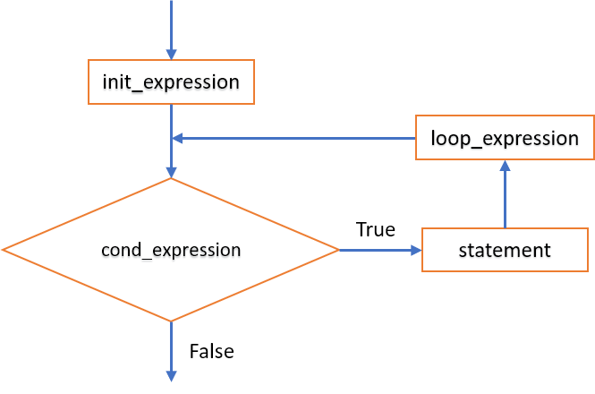

<h2 align="center"> 
3 - Các cấu trúc điều khiển
</h2>

<div class="header">
<h3>3.1 - Cấu trúc tuần tự (sequence)</h3>

<h3>3.2 - <a href="#selection">Cấu trúc rẽ nhánh (selection)</a></h3>
<ul>
<h4>3.2.1 - Câu lệnh <b>if</b></h4>
<h4>3.2.2 - Câu lệnh <b>switch</b></h4>
</ul>

<h3>3.3 - <a href="#repetition">Cấu trúc lặp (repetition)</a></h3>
<ul>
<h4>3.3.1 - Lệnh <b>for</b></h4>
<h4>3.3.2 - Lệnh <b>while</b></h4>
<h4>3.3.3 - Lệnh <b>do-while</b></h4>
</ul>
</div>

Một vấn đề quan trọng trong lập trình là làm sao điều khiển thi hành các khối lệnh theo trình tự như giải thuật đã mô tả. 

Theo phương pháp lập trình cấu trúc, mọi chương trình đều có thể tạo thành từ sự kết hợp của ba cấu trúc điều khiển cơ bản: tuần tự (sequence), rẽ nhánh hay lựa chọn (selection), và lặp (repetition).

## 3.1 - Cấu trúc tuần tự (sequence)

- Cài đặt cấu trúc tuần tự bằng cách đặt các câu lệnh theo thứ tự cần thực hiện.


## 3.2 - <a name="selection">Cấu trúc rẽ nhánh (selection)</a>

### 3.2.1 - Câu lệnh **if**

#### Dạng 1


##### Cú pháp
```c
if(condition)
    {
        // Khối lệnh được thực hiện khi biểu thức logic <condition> != 0 (true)
        // <Lệnh>;
    }
```
- `<condition>` là một biểu thức logic, có kết quả đúng (!=0, thường là 1), hoặc sai (== 0).

##### Ví dụ:
```c
int a = 36;
if(a % 2 == 0) printf("%d la so chan\n", a);
```

#### Dạng 2


##### Cú pháp
```c
if(condition)
    {
        // Khối lệnh được thực hiện khi biểu thức condition != 0 (true)
        // <Lệnh 1>;
    }
else
    {
        // Khối lệnh được thực hiện khi biểu thức condition == 0 (false)
        // <Lệnh 2>;
    }
```

##### Ví dụ:
```c
int a = 36;
if(a % 2 == 0) printf("%d la so chan\n", a);
else printf("%d la so le\n", a);
```

<div class="note">
<p>
<ul>
    <li>Nếu khối chỉ có 1 câu lệnh thì không cần đặt trong cặp ký tự <code>{}</code>.</li>
    <li>Câu lệnh <code>if</code> có thể lồng nhau, khi đó điều kiện sau từ khóa <code>else</code> sẽ ngược lại với điều kiện ở <code>if</code> ngay trước nó.</li>
    <li>Khi sử dụng các lệnh <code>if</code> lồng nhau, nên sử dụng cấu trúc <code>else</code> để loại trừ các trường hợp.</li>
</ul>
</p>
</div>

<details>
<summary>Ví dụ</summary>
<p>

```c
/*
Tính tiền taxi dựa vào quãng đường đi và bảng giá.
Bảng giá:
<= 1 km dau: 15000 đ
Từ km thứ 2 đến km thứ 5: 13500 đ/km
Từ km thứ 6 trở đi: 11000 đ/km
Nếu vượt 120 km được giảm 10% tổng tiền.

* Input: 
- Số km (nhập từ bàn phím)
- Bảng giá

* Output: Số tiền phải thanh toán.
*/

#include <stdio.h>

int main()
{
	float sokm, sotien=0;
	
	printf("Nhap quang duong di (km):");
	scanf("%f", &sokm);
	
	if(sokm <= 0)	printf("Quang duong phai > 0.\n");
	else
		if(sokm <= 1)	sotien = 15000;
		else
			// <-> (sokm > 1 && sokm <= 5)
			if(sokm <= 5)	sotien = 15000 + (sokm - 1) * 13500;
			else
				// <-> (sokm > 5 && sokm <= 120)
				if(sokm <= 120) 
					sotien = 15000 + 4 * 13500 + (sokm - 5) * 11000;
				else
					// <-> (sokm > 120)
					sotien = (15000 + 4 * 13500 + (sokm - 5) * 11000) * 0.9;
				
	printf("\n--------------------------------\n");
	printf("Quang duong:\t%10.2f (km)\nSo tien:\t%10.2f (d)\n", sokm, sotien);
}
```

</p>
</details>

<details>
<summary>Ví dụ 2</summary>
<p>

https://github.com/nd-hung/introduction2programming/blob/908a0ccf014af24c33bc916b1e499de35d3b7817/03-control-structures/src/tinhtientaxi.c

</p>
</details>


### 3.2.2 - Câu lệnh rẽ nhánh **switch**


#### Cú pháp:
```c
switch(expression) {
  case value_1:
    // <Lệnh 1>;
    break;
  case value_2:
    // <Lệnh 2>;
    break;
  case value_3::
    // <Lệnh 3>;
    break;
    // ...

  default:
    // <Lệnh n>;
}
```

- Cấu trúc `switch` chọn thực hiện các lệnh dựa trên so sánh biểu thức `<expression>` với các giá trị được xét.
- Biểu thức và các các hằng giá trị phải có kiểu rời rạc (integral): số nguyên (có hoặc không dấu), ký tự (được trình biên dịch chuyển sang mã ASCII tương ứng), thành viên của kiểu liệt kê (được trình biên dịch chuyển sang số nguyên tương ứng), các trường `bit` (0,1).
- Các giá trị `value_1, value_2, ...` phải là hằng và không được trùng nhau. 

#### Thực hiện:
- Biểu thức <expression> lần lượt được so sánh với từng giá trị `value_1, value_2, ...`, nếu trùng khớp thì chương trình thực hiện `<lệnh/khối lệnh>` tương ứng.
- Khi gặp lệnh **break**, chương trình sẽ thoát khỏi khối **switch**.
- Nếu sau một trường hợp mà không gọi lệnh **break**, chương trình chuyển xuống xử lý trường hợp kế tiếp.
- Nếu biểu thức không trùng với giá trị nào đã xét, lệnh/khối lệnh ở sau nhãn **default** được thực thi.

<div class="note">
<p>
<ul>
    <li> Câu lệnh <code>switch</code> có thể lồng nhau.</li>
    <li> Khối rẽ nhánh cài đặt được bằng lệnh <code>switch</code> thì cũng cài đặt được bằng lệnh <code>if</code>. Ngược lại có thể không đúng.</li>
</ul>
</p>
</div>

<details>
<summary>Ví dụ</summary>
<p>

```c
/*
Nhập một tháng dương lịch, in ra số ngày của tháng đó.

Input: tháng trong năm (1..12)
Output: số ngày của tháng.

Biết: Trong một năm dương lịch:
- Tháng 1,3,5,7,8,10,12 có 31 ngày.
- Tháng 4,6,9,11 có 30 ngày.
- Tháng 2: năm nhuận có 29 ngày, năm không nhuận có 28 ngày.
(Năm nhuận là năm thỏa mãn 1 trong 2 điều kiện:
    + Chia hết cho 400
    + Chia hết cho 4 và không chia hết 100)
*/

#include <stdio.h>

int main()
{
    unsigned char month;

    printf("Nhap mot thang duong lich:");
    scanf("%d", &month);

    /* Cách 1 - Sử dụng lệnh rẽ nhánh if 

    if(month == 1 || month == 3 || month == 5 || month == 7 || month == 8 || month == 10 || month == 12)
        printf("Thang %d co 31 ngay\n", month);

    if(month == 4 || month == 6 || month == 9 || month == 11)
        printf("Thang %d co 30 ngay\n", month);
    
    if(month == 2)
    {
        int year;
        printf("Xin nhap nam:");
        scanf("%d", &year);
        if((year % 400 == 0) || (year % 4 == 0 && year % 100 !=0)) // -> nam nhuan
            printf("Thang %d/%d co 29 ngay", month, year);
        else
            printf("Thang %d/%d co 28 ngay", month, year);
    }

    if(month < 1 || month > 12)
        printf("Khong co thang %d", month);
    */

   // Cách 2 - Sử dụng cấu trúc rẽ nhánh switch
   switch (month)
   {
   case 1:
   case 3:
   case 5:
   case 7:
   case 8:
   case 10:
   case 12: printf("Thang %d co 31 ngay\n", month); break;
   case 4:
   case 6:
   case 9:
   case 11: printf("Thang %d co 30 ngay\n", month); break;
   case 2:
        {
            int year;
            printf("Xin nhap nam:");
            scanf("%d", &year);
            if((year % 400 == 0) || (year % 4 == 0 && year % 100 !=0)) // -> nam nhuan
                printf("Thang %d/%d co 29 ngay", month, year);
            else
                printf("Thang %d/%d co 28 ngay", month, year);
            break;
        }
   default:  printf("Khong co thang %d", month); 
   }
}
```
</p>
</details>

<h3><a name="repetition">3.3 - Cấu trúc lặp (repetition)</a></h3>

Cấu trúc điều khiển lặp cho phép lặp lại khối lệnh theo một điều kiện xác định.

### 3.3.1 - Câu lệnh lặp **for**



#### Cú pháp:

```c
 for (init_expression; cond_expression; loop_expression) 
    {
        // statement   
        // <Lệnh>;
    }
 ```
 - `init_expression`: Biểu thức khởi đầu
 - `cond_expression`: Biểu thức điều kiện lặp
 - `loop_expression`: Biểu thức lặp (bước nhảy)

 #### Thực hiện:
- Lệnh khởi đầu `init_expression` được thi hành 1 lần.
- Biểu thức `cond_expression` xác định điều kiện thực thi khối lệnh. Nếu `cond_expression` có giá trị đúng (!= 0) thì khối lệnh `statement` được thi hành.
- Lệnh `loop_expression` được thực hiện sau khối lệnh `statement`, xác định bước nhảy cho vòng lặp.

<div class="note">
<p>
<ul>
    <li>Câu lệnh <code>for</code> có thể lồng nhau.</li>
    <li>Nên dùng lệnh <code>for</code> cho các vòng lặp có số lần lặp xác định.</li>
</ul>
</p>
</div>

<details>
<summary>Ví dụ</summary>
<p>

```c
/*
Một số tự nhiên n được gọi là số hoàn hảo (perfect number) nếu tổng các ước số < n bằng n.
Ví dụ: 6 là một số hoàn hảo vì tổng các ước số của nó là 1+2+3 = 6.
Hãy viết chương trình tìm & in ra các số hoàn hảo <= 10000.
*/

#include<stdio.h>

int main()
{
    unsigned int n=10000,tonguocso,i,j;
    
    printf("Cac so hoan hao <= %d la:\n", n);

    // Xét các số từ 1 đến n
    for(i=1; i <= n; i++)
        {
            // Với mỗi số i, tính tổng các ước số < i
            tonguocso = 0;
            for(j=1; j <= i/2; j++)
                if(i %j == 0) tonguocso += j;
            // Nếu tổng ước số == i -> i là số thỏa mãn
            if(tonguocso == i) printf("%d\n", i);
        }
}
```
</p>
</details>

### 3.3.2 - Câu lệnh lặp **while**
- Câu lệnh **while** lặp lại một khối lệnh chừng nào điều kiện xác định còn thỏa mãn.


#### Cú pháp:
```c
while (condition) 
{
  // Khối lệnh được thi hành khi <condition> còn đúng (!= 0)
  // <Lệnh>;
}
```
- Biểu thức `condition` phải có kiểu số học (arithmetic) hoặc con trỏ (pointer).

#### Thực hiện:
- Bước 1: Biểu thức điều kiện `condition` được kiểm tra. 
- Bước 2: 
    - Nếu biểu thức `condition` có giá trị sai (== 0), khối lệnh không được thi hành, vòng lặp dừng.
    - Nếu biểu thức 'condtion` có giá trị đúng (!= 0), khối lệnh được thi hành và quay lại bước 1.

<details>
<summary>Ví dụ </summary>
<p>

```c
/*
Tìm ước số chung lớn nhất của 2 số nguyên dương a,b.

Input: a, b > 0
Output: USCLN(a,b).
*/

#include<stdio.h>

int main()
{
    unsigned int a,b;
    unsigned int a0,b0; // Để lưu lại giá trị ban đầu của a,b

    do{
        printf("a = ");
        scanf("%d", &a);
    }while(a <= 0);
    a0 = a;

    do{
        printf("b = ");
        scanf("%d", &b);
    }while(b <= 0);
    b0 = b;

    while(a != b)
        if(a > b) a -= b;
        else b -= a;
    
    printf("USCLN(%d, %d) = %d\n", a0,b0,a);
}
```
</p>
</details>

<div class="note">
<p>
<ul>
    <li>Câu lệnh <code>while</code> có thể lồng nhau.</li>
    <li>Cần kiểm soát để điều kiện lặp sai (== 0) sau hữu hạn bước. Nếu không, lệnh <code>while</code> sẽ lặp vô tận. </li>
</ul>
</p>
</div>

### 3.3.3 - Câu lệnh lặp **do-while**
- Câu lệnh **do-while** lặp lại một khối lệnh cho đến khi biểu thức điều kiện có giá trị sai.


#### Cú pháp:
```c
do
{
    // <Lệnh>;
}while(condition);
```
- Biểu thức `condition` phải có kiểu số hoặc con trỏ.
- Việc kiểm tra biểu thức `condition` thực hiện sau khối lệnh. Vì thế khối lệnh lặp ít nhất 1 lần.

#### Thực hiện:

- Bước 1: Khối lệnh được thực hiện. 
- Bước 2: Biểu thức điều kiện `condition` được kiểm tra
    - Nếu biểu thức `condition` có giá trị sai (== 0), vòng lặp dừng.
    - Nếu biểu thức 'condtion` có giá trị đúng (!= 0), khối lệnh được thi hành và quay lại bước 1.

<div class="note">
<p>
<ul>
    <li>Câu lệnh <code>do-while</code> có thể lồng nhau.</li>
    <li>Tương tự lệnh <code>while</code>, lệnh <code>do-while</code> có thể bị lặp vô tận. </li>
</ul>
</p>
</div>

<details>
<summary>Ví dụ </summary>
<p>

```c
/*
Viết chương trình lặp lại việc nhập một số nguyên từ bàn phím 
cho đến khi nhập số 0 thì dừng và in ra tổng các số vừa nhập.
*/

#include<stdio.h>

int main()
{
    int n, sum=0;

    do{
        printf("Nhap mot so nguyen (nhap 0 de dung):");
        scanf("%d", &n);
        sum += n;
    }while(n != 0);

    printf("Tong cac so vua nhap = %d\n", sum);
}
```

</p>
</details>