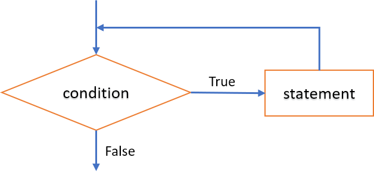
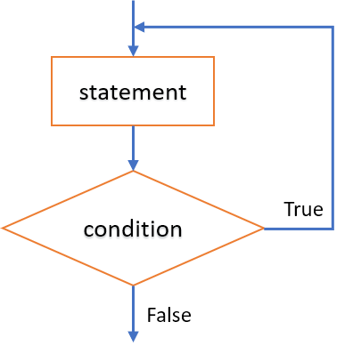

<h3>3.3 - Cấu trúc lặp (repetition)
<ul>
<h4>3.3.1 - Lệnh <b>for</b></h4>
<h4>3.3.2 - Lệnh <b>while</b></h4>
<h4>3.3.3 - Lệnh <b>do-while</b></h4>
</ul>
</div>

Cấu trúc điều khiển lặp cho phép lặp lại khối lệnh theo một điều kiện xác định.

### 3.3.1 - Câu lệnh lặp **for**
Sử dụng câu lệnh **for** khi cần lặp lại một lệnh/khối lệnh dựa theo một điều kiện cho trước.


#### Cú pháp:

```c
 for (init_expression; cond_expression; loop_expression) 
    {
        // statement   
        // <Lệnh>;
    }
 ```
 - `init_expression`: Biểu thức khởi đầu
 - `cond_expression`: Biểu thức điều kiện lặp
 - `loop_expression`: Biểu thức lặp (bước nhảy)

 #### Thực hiện:
- Lệnh khởi đầu `init_expression` được thi hành 1 lần.
- Biểu thức `cond_expression` xác định điều kiện thực thi khối lệnh. Nếu `cond_expression` có giá trị đúng (!= 0) thì khối lệnh `statement` được thi hành.
- Lệnh `loop_expression` được thực hiện sau khối lệnh `statement`, xác định bước nhảy cho vòng lặp.

<div class="note">
<p>
<ul>
    <li>Câu lệnh <code>for</code> có thể lồng nhau.</li>
    <li>Nên dùng lệnh <code>for</code> cho các vòng lặp có số lần lặp xác định.</li>
</ul>
</p>
</div>

<details>
<summary>Ví dụ</summary>
<p>

```c
/*
Một số tự nhiên n được gọi là số hoàn hảo (perfect number) nếu tổng các ước số < n bằng n.
Ví dụ: 6 là một số hoàn hảo vì tổng các ước số của nó là 1+2+3 = 6.
Hãy viết chương trình tìm & in ra các số hoàn hảo <= 10000.
*/

#include<stdio.h>

int main()
{
    unsigned int n=10000,tonguocso,i,j;
    
    printf("Cac so hoan hao <= %d la:\n", n);

    // Xét các số từ 1 đến n
    for(i=1; i <= n; i++)
        {
            // Với mỗi số i, tính tổng các ước số < i
            tonguocso = 0;
            for(j=1; j <= i/2; j++)
                if(i %j == 0) tonguocso += j;
            // Nếu tổng ước số == i -> i là số thỏa mãn
            if(tonguocso == i) printf("%d\n", i);
        }
}
```
</p>
</details>

### 3.3.2 - Câu lệnh lặp **while**
- Câu lệnh **while** lặp lại một khối lệnh chừng nào điều kiện xác định còn thỏa mãn.



#### Cú pháp:
```c
while (condition) 
{
  // Khối lệnh được thi hành khi <condition> còn đúng (!= 0)
  // <Lệnh>;
}
```
- Biểu thức `condition` phải có kiểu số học (arithmetic) hoặc con trỏ (pointer).

#### Thực hiện:
- Bước 1: Biểu thức điều kiện `condition` được kiểm tra. 
- Bước 2: 
    - Nếu biểu thức `condition` có giá trị sai (== 0), khối lệnh không được thi hành, vòng lặp dừng.
    - Nếu biểu thức 'condtion` có giá trị đúng (!= 0), khối lệnh được thi hành và quay lại bước 1.

<details>
<summary>Ví dụ </summary>
<p>

```c
/*
Tìm ước số chung lớn nhất của 2 số nguyên dương a,b.

Input: a, b > 0
Output: USCLN(a,b).
*/

#include<stdio.h>

int main()
{
    unsigned int a,b;
    unsigned int a0,b0; // Để lưu lại giá trị ban đầu của a,b

    do{
        printf("a = ");
        scanf("%d", &a);
    }while(a <= 0);
    a0 = a;

    do{
        printf("b = ");
        scanf("%d", &b);
    }while(b <= 0);
    b0 = b;

    while(a != b)
        if(a > b) a -= b;
        else b -= a;
    
    printf("USCLN(%d, %d) = %d\n", a0,b0,a);
}
```
</p>
</details>

<div class="note">
<p>
<ul>
    <li>Câu lệnh <code>while</code> có thể lồng nhau.</li>
    <li>Cần kiểm soát để điều kiện lặp sai (== 0) sau hữu hạn bước. Nếu không, lệnh <code>while</code> sẽ lặp vô tận. </li>
</ul>
</p>
</div>

### 3.3.3 - Câu lệnh lặp **do-while**
- Câu lệnh **do-while** lặp lại một khối lệnh cho đến khi biểu thức điều kiện có giá trị sai.



#### Cú pháp:
```c
do
{
    // <Lệnh>;
}while(condition);
```
- Biểu thức `condition` phải có kiểu số hoặc con trỏ.
- Việc kiểm tra biểu thức `condition` thực hiện sau khối lệnh. Vì thế khối lệnh lặp ít nhất 1 lần.

#### Thực hiện:

- Bước 1: Khối lệnh được thực hiện. 
- Bước 2: Biểu thức điều kiện `condition` được kiểm tra
    - Nếu biểu thức `condition` có giá trị sai (== 0), vòng lặp dừng.
    - Nếu biểu thức 'condtion` có giá trị đúng (!= 0), khối lệnh được thi hành và quay lại bước 1.

<div class="note">
<p>
<ul>
    <li>Câu lệnh <code>do-while</code> có thể lồng nhau.</li>
    <li>Tương tự lệnh <code>while</code>, lệnh <code>do-while</code> có thể bị lặp vô tận. </li>
</ul>
</p>
</div>