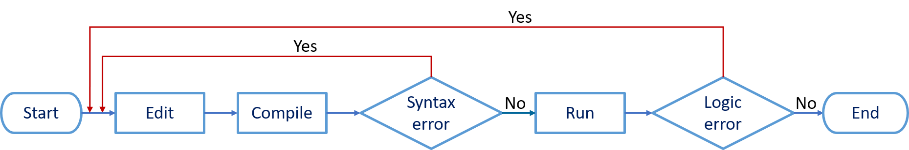

<h2 align="center"> 
NHẬP MÔN LẬP TRÌNH
</h2>

### [Nguyễn Đình Hưng](https://nd-hung.github.io/)
#### Khoa Công nghệ thông tin, Trường đại học Nha Trang
 

 

### [1 - Thiết lập môi trường lập trình C/C++](01-environment-setup) 
### [2 - Cơ bản về ngôn ngữ C](02-basic) 
### [3 - Các cấu trúc điều khiển](03-control-structures) 
### [4 - Hàm ](04-functions) 
### [5 - Kiểu mảng, chuỗi](05-arrays-strings) 
### [6 - Kiểu dữ liệu cấu trúc (struct)](06-struct) 
### [7 - Xử lý file]() 

### [Tài liệu tham khảo](references.md)
