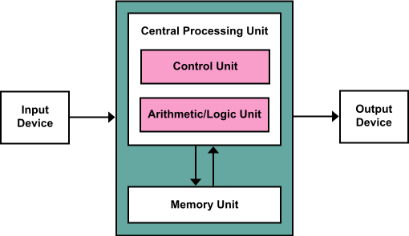

# Các khái niệm cơ bản về lập trình

Fundamentals of Computer Programming

---

## Máy tính, chương trình và lập trình

### Cấu trúc cơ bản của máy tính điện tử

- Máy tính điện tử (electronic computer) là thiết bị điện tử có khả năng xử lý thông tin theo chương trình lập sẵn.
- Máy tính điện tử ngày nay được chế tạo theo [kiến trúc Von Neumann](https://en.wikipedia.org/wiki/Von_Neumann_architecture)

- Các thành phần chính của máy tính điện tử:
    - Bộ xử lý trung tâm (central processing unit) có chức năng điều khiển, thực hiện các tính toán số học và logic.
    - Bộ nhớ (memory) lưu trữ dữ liệu (data) và chương trình (programs).
    - Thiết bị nhập/xuất (input/output devices).

### Đặc điểm cơ bản của máy tính điện tử

- Hoạt động (xử lý dữ liệu) theo chương trình lập sẵn.
- Tốc độ xử lý rất nhanh & chính xác.
- Máy tính điện tử chỉ xử lý được các lệnh và dữ liệu được biểu diễn dưới dạng mã nhị phân.

## Giải thuật và lập trình

- Để giải quyết một bài toán bằng máy tính, con người phải tạo ra chương trình gồm dãy các lệnh thực hiện nhận dữ liệu đầu vào, xử lý dữ liệu và xuất ra kết quả mong muốn.

## Ngôn ngữ lập trình